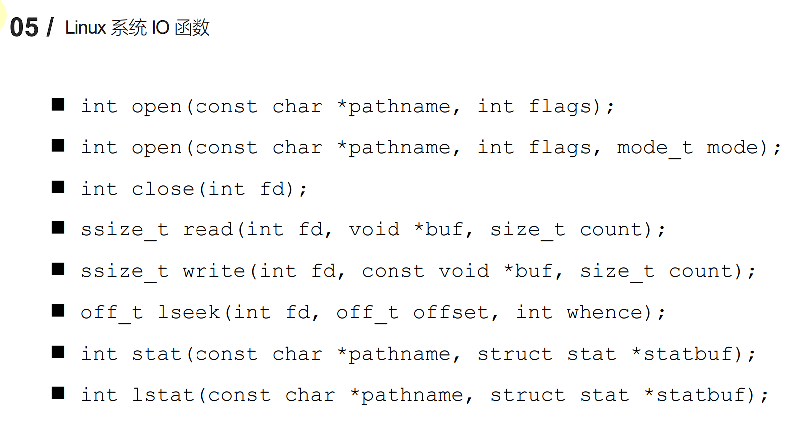

# 项目时间：2024/12/24——

项目网盘资料：https://pan.baidu.com/s/1nRT92Uci46yrsK86t9xYDA?pwd=6bsg 提取码: 6bsg

---

**2024/12/25**

 [1.10 Makefile.pptx.pdf](D:\webserver笔记\源码、笔记、PPT\linuxServer\slide\01Linux系统编程入门\03 Makefile\1.10 Makefile.pptx.pdf) 

**2024/12/27**

 [1.13 GDB调试.pdf](D:\webserver笔记\源码、笔记、PPT\linuxServer\slide\01Linux系统编程入门\04 GDB调试\1.13 GDB调试.pdf) 

**2024/12/28**

 [1.7 文件IO.pdf](D:\webserver笔记\源码、笔记、PPT\linuxServer\slide\01Linux系统编程入门\05 文件IO\1.7 文件IO.pdf) 

程序/文件不占用内存空间，只占用磁盘空间

进程（比如说可执行文件运行起来）是操作系统分配的资源，占用内存空间。一个进程启动以后，会有一个虚拟地址空间，通过CPU中的MMU把虚拟地址空间中的程序映射到硬件空间中去。

  [1.2 GCC.pdf](D:\webserver笔记\源码、笔记、PPT\linuxServer\slide\01Linux系统编程入门\01 GCC\1.2 GCC.pdf) 

预处理：#define、删除注释，都是在预处理阶段做的

**2024/12/29**

 [1.4 静态库的制作.pdf](D:\webserver笔记\源码、笔记、PPT\linuxServer\slide\01Linux系统编程入门\02 静态库与动态库\1.4 静态库的制作.pdf) 

**静态库**在程序的链接阶段被复制到程序中

**动态库**在链接阶段没有被复制到程序中，而是程序在运行时由系统动态加载到内存中供程序调用。

  [1.6 动态库的制作和使用.pptx.pdf](D:\webserver笔记\源码、笔记、PPT\linuxServer\slide\01Linux系统编程入门\02 静态库与动态库\1.6 动态库的制作和使用.pptx.pdf) 

**动态库**：GCC进行链接时，动态库的代码不会被打包到可执行程序中。

**静态库**：GCC进行链接时，会把静态库中的代码打包到可执行程序中。

**2025/1/8**

 [1.9 静态库和动态库的对比.pdf](D:\webserver笔记\源码、笔记、PPT\linuxServer\slide\01Linux系统编程入门\02 静态库与动态库\1.9 静态库和动态库的对比.pdf) 

如果库非常小，建议使用静态库；反之使用动态库。

**静态库的优点：**

- 静态库被打包到应用程序中加载速度快。
- 发布程序无需提供静态库，移植方便。

**缺点：**

- 消耗系统资源，浪费内存
- 更新、部署、发布麻烦

---

**Linux系统IO函数**

