# 安排

- [ ] C++网课 14/94

  ---

  👇【9】C++函数的学习

  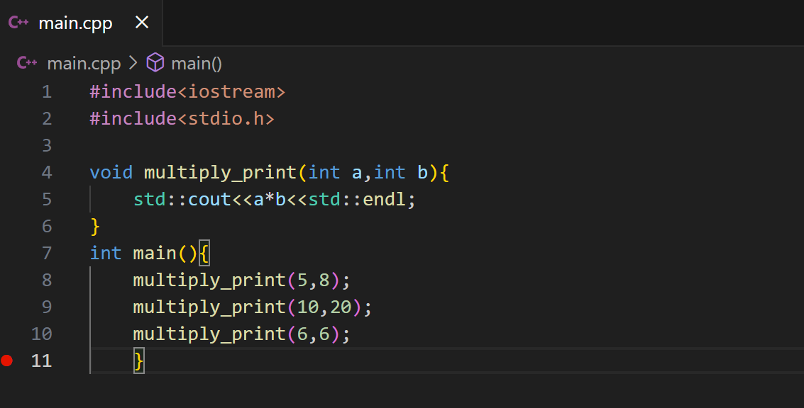

  ---

  👇【10】C++头文件的学习

  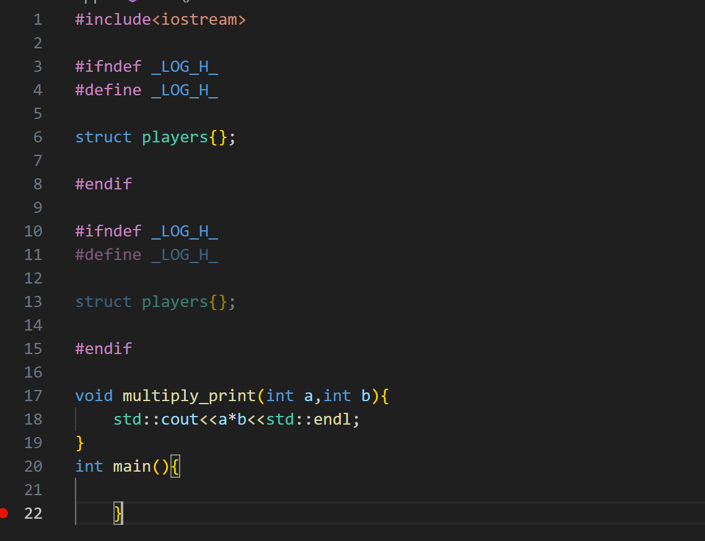

  上述代码中

  ```c++
  #ifndef _LOG_H_
  #define _LOG_H_
  
  struct players{};
  
  #endif
  ```

  意思是没有定义过**__LOG_H_ _**，就定义一个**__LOG_H_ _**，这样起到了一个避免重复声明的作用，因此在设计头文件时，最好都这么写一下，在**main.cpp**中引用头文件时，就不需要考虑是否回重复声明导致报错的问题。

  👇贴一段关于**ifndef**作用的声明
  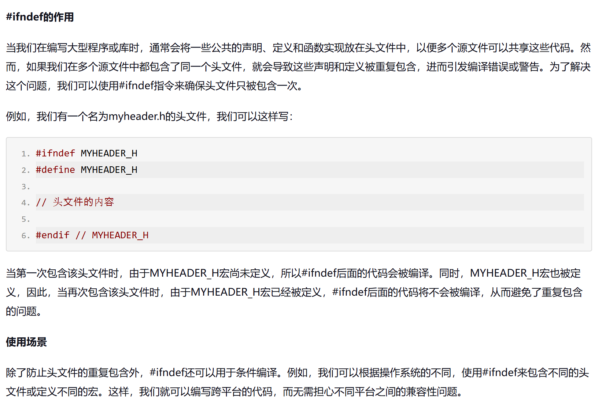

  ---

  > [!NOTE]
  >
  > 关于**#include< >**和**#include" "**的区别：当要引用的头文件不在当前文件夹，告诉程序要搜索头文件所在的路径时，用**#include< >**；当要引用的头文件在主程序在同一个文件夹时用**#include" "**，如果在当前文件没查找到头文件，会继续从**项目配置的头文件引用目录**查找头文件,因此使用**#include" "**的范围更广一点。
  >
  > 
  >
  > 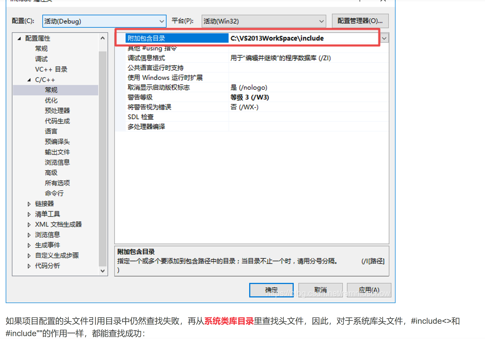

  ---

  👇【11】C++调试工具的学习
  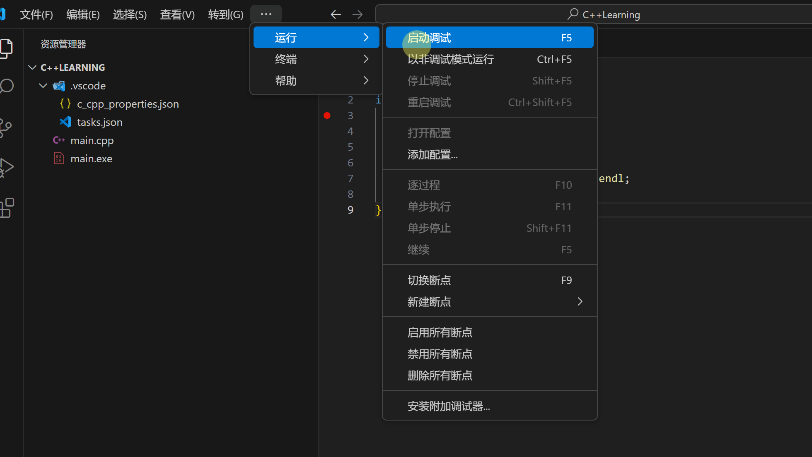

  预先设置一个断点，这里的黄色光标箭头的位置时指向下一步即将运行的语句。
  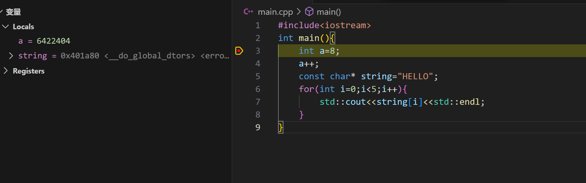

  此时**a**还未被赋值为8，
  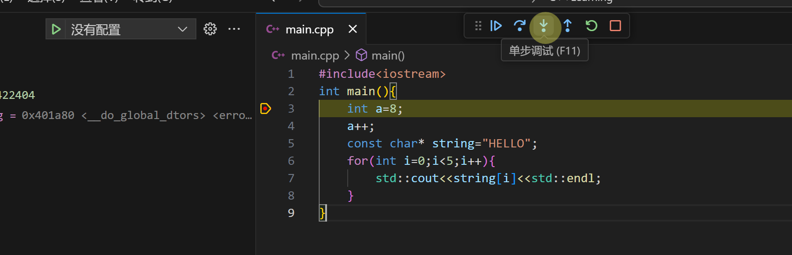

  点击单步调试以后，a被赋值为8

  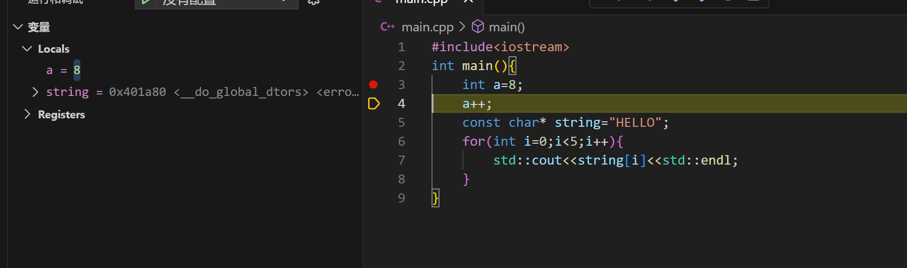

  同理下一步即将执行**a++**。执行之后，a此时的值为9。

  ---

  👇【12】C++条件与分支

  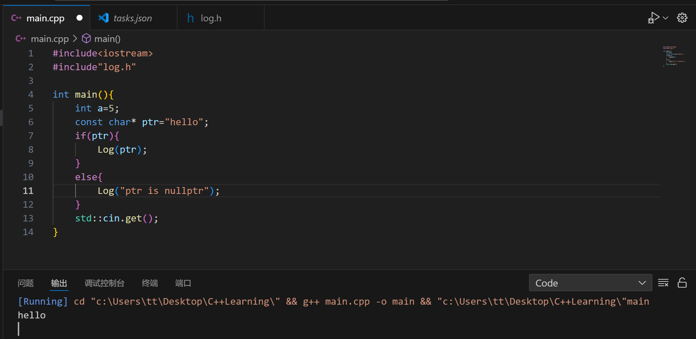

  上述代码的意思是：如果**ptr**指向空，则输出“ptr is nullptr”，如果不指向空，则打印ptr指向地址的元素。在这里，ptr被设置为指向一个字符串“hello”的地址，因此会打印出字符串。接下去做一些小修改：
  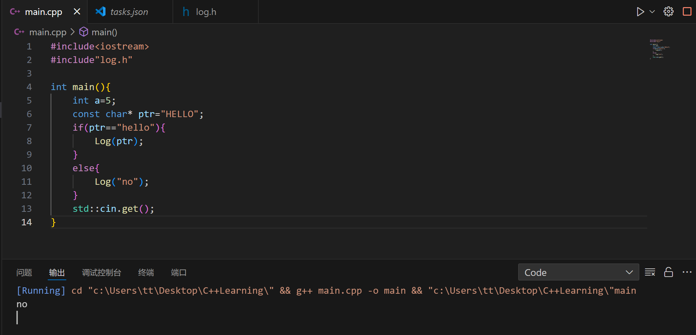

  ---

  👇【14】C++循环

  同样输出5句**”Hello world!“**也有骚操作

  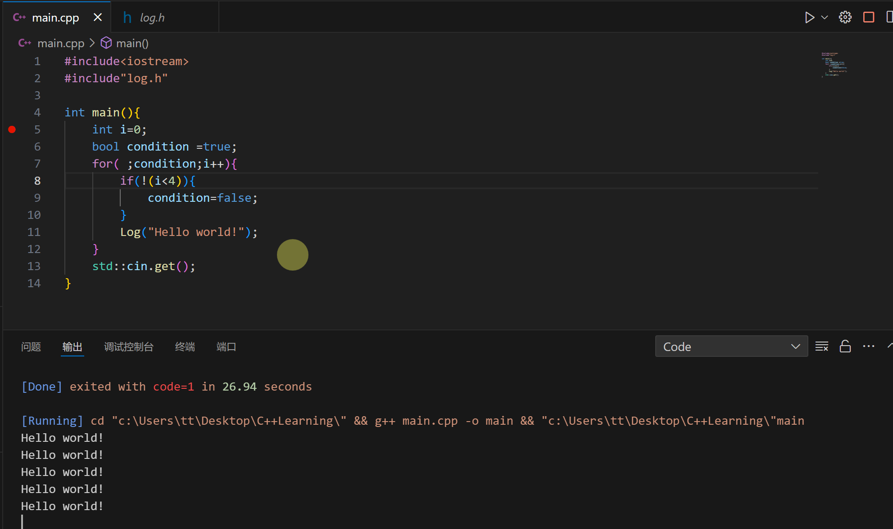

  对于for循环来说格式是这样的**for(初始情况;condition;(控制循环前进的语句))**对于其中的condition=true的情况，循环会执行，流程为：**求解表达式1。
  求解表达式2。若其值为真，则执行 for 语句中指定的内嵌语句，然后执行第3步；若表达式2值为假，则结束循环，转到第5步。
  求解表达式3。
  转回上面第2步继续执行。
  循环结束，执行 for 语句下面的语句。**

  如果使用while语句，也可以达到同样的输出效果：
  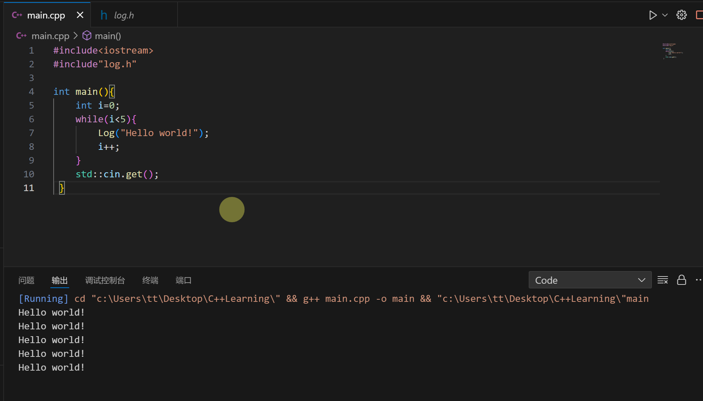

  还有一种循环的方式
  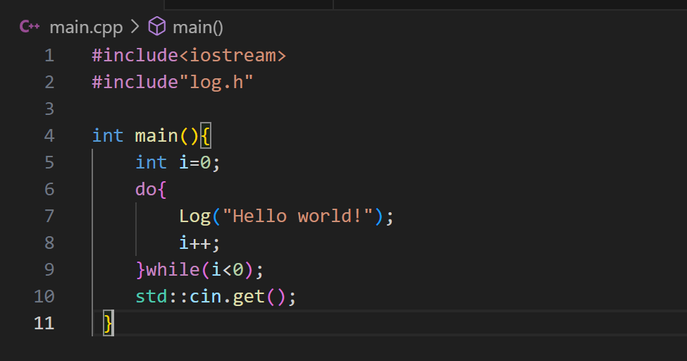

  但是这种方法并不常用。在判断while()中条件是否成立前，一定会执行一遍do{ }中的内容。

- [ ] 代码随想录（/3）

- [ ] FPGA基础课（试听一下找一下节奏）

  