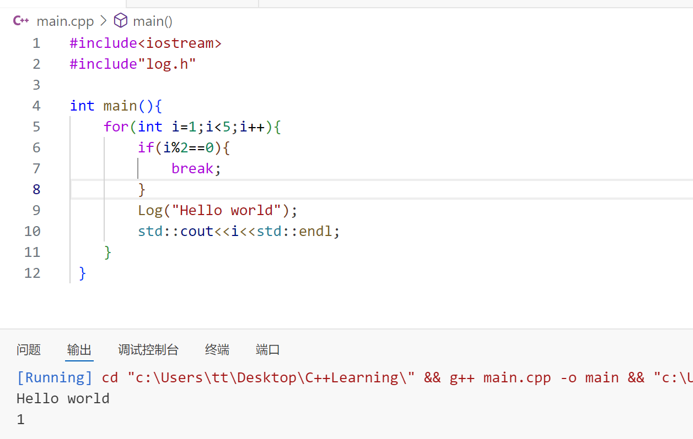
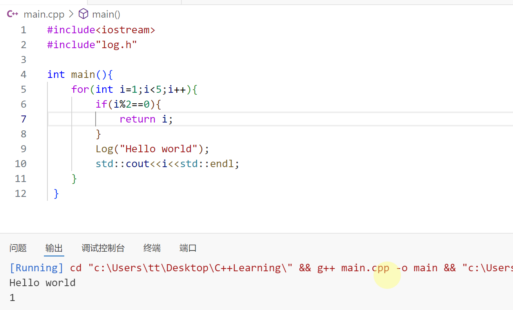

# 安排

- [x] 下午两点半-实验室设备使用规范培训
- [x] 用vscode+iverilog进行轻量化的仿真👇

  > [!NOTE]
  >
  > 记得在testbench文件中要加入`include"test.v"

[序列检测器（两种设计方法和四种检测模式|verilog代码|Testbench|仿真结果）_使用移位寄存器设计序列检测器-CSDN博客](https://blog.csdn.net/Loudrs/article/details/130292586?ops_request_misc=%7B%22request%5Fid%22%3A%222ff6eb44e09debd07f7cb632b73cd090%22%2C%22scm%22%3A%2220140713.130102334..%22%7D&request_id=2ff6eb44e09debd07f7cb632b73cd090&biz_id=0&utm_medium=distribute.pc_search_result.none-task-blog-2~all~sobaiduend~default-2-130292586-null-null.142^v100^pc_search_result_base7&utm_term=verilog和testbench&spm=1018.2226.3001.4187)

[实现VScode编译Verilog并查看波形图_vscode iverilog-CSDN博客](https://blog.csdn.net/2302_77108665/article/details/137685490)

- [ ] C++学习 15/94

  ---

  

  👇【15】C++控制流语句

当**continue**执行时，会跳过之后的语句，直接进行下一次循环。

当把**continue**改成**break**之后，程序仅在i=1时打印；当i=2时，**i%2==0**的条件满足，执行**break**循环到此结束。

👆对于**return**来说，也起到一个break的作用，当**return**执行后，循环也随之结束。 

