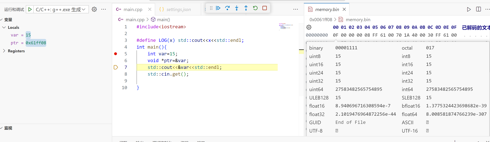
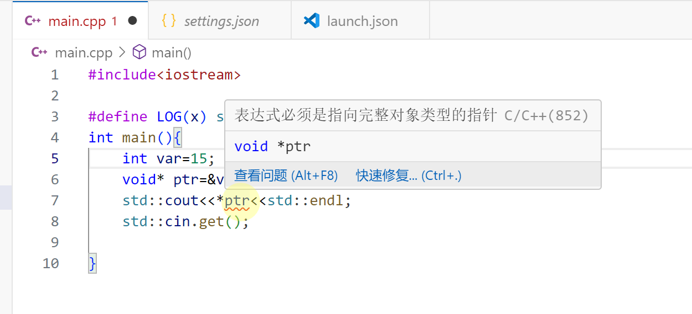
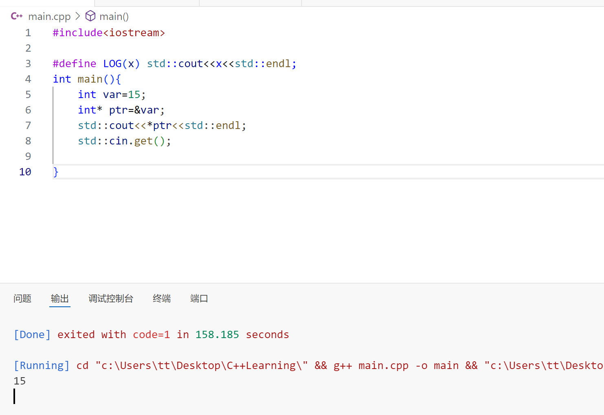
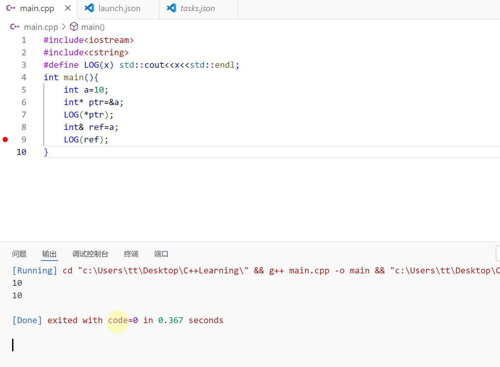
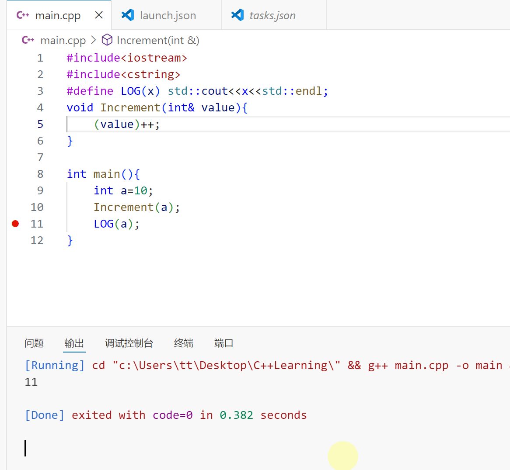
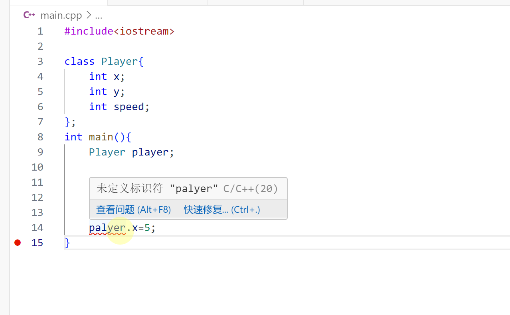
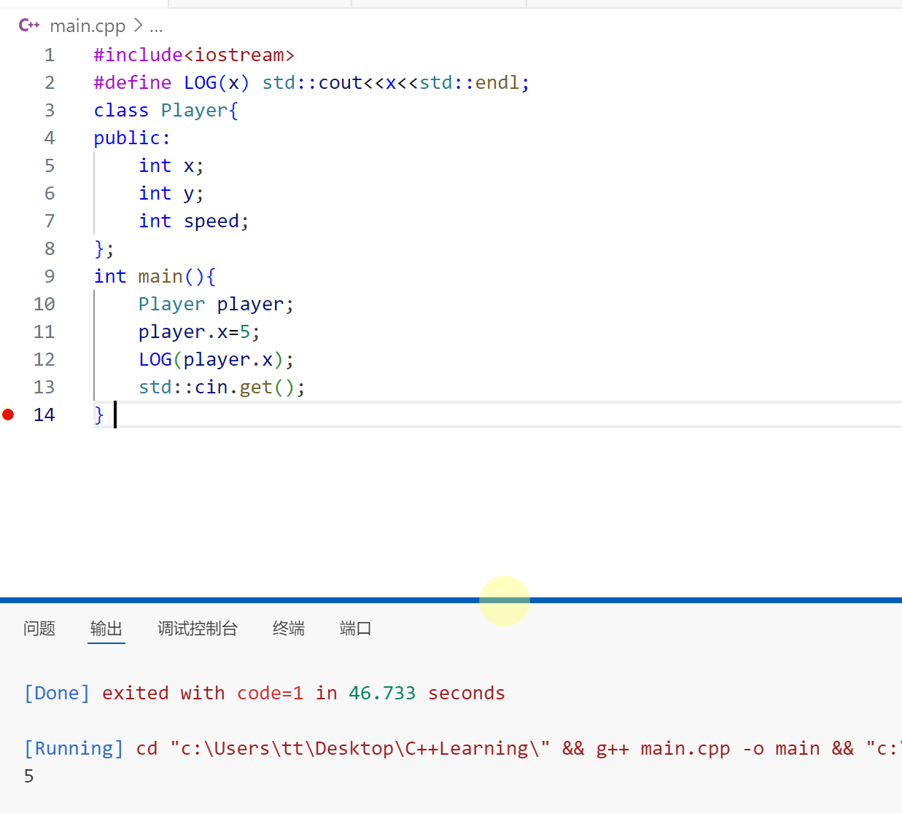
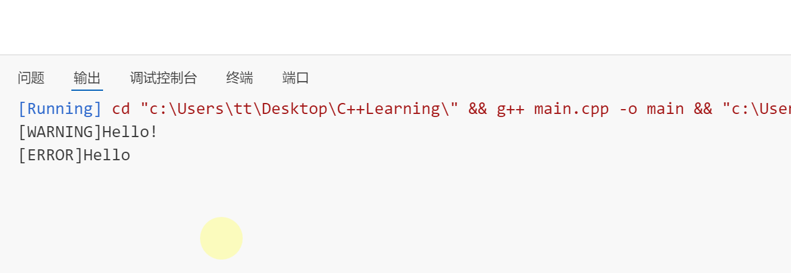

# 安排

- [ ] C++学习 19/94

  ---

  👇【16】C++指针  



这段代码中 **void *ptr**定义了一种空类型的指针（不关心指针类型），将var的地址（&var）赋值给ptr，通过**std::cout<<&var<<std::endl;**打印出var的地址，打开**memory**可以看到，对应的地址存放了var的数值15。





对于空指针**void* ptr**无法直接打印其指向内存地址的变量值，但是如果该称与指向对象类型相同的指针**int* ptr**就可以打印处指针指向内存地址的值。

---

👇【17】C++引用  



**ref**相当于给**a**起了个别名。关于引用的一个例子👇


---

👇【18】C++类

新建了一个类**Player**，而在主函数中实例化了一个**player**。默认情况下，一个类中的所有对象都是私有的，这意味着只有类中的函数才能访问这些变量，如果想在**main**中访问这些变量，需要在类中修改为**public**，这样我们可以在类以外的地方访问这些变量。 	



下面这是一个例子：

一个实例：

---

👇【19】C++类与结构体的对比

> [!IMPORTANT]
>
> class默认私有，而struct默认公有。

一个设置错误级别的实例：

```C++
#include<iostream>

class Log{
public:
    int LogLevelError=0;
    int LogLevelWarning=1;
    int LogLevelInfo=2;
private:
    int m_LogLevel=LogLevelInfo;
public:
    void SetLevel(int level){
        m_LogLevel=level;
    } 
    void Warn(const char* message){
        if(m_LogLevel>=LogLevelWarning){
        std::cout<<"[WARNING]"<<message<<std::endl;
        }
    }
    void Error(const char* message){
        if(m_LogLevel>=LogLevelError){
        std::cout<<"[ERROR]"<<message<<std::endl;
        }
    }
    void Info(const char* message){
        if(m_LogLevel>=LogLevelInfo){
        std::cout<<"[INFO]"<<message<<std::endl;
        }
    }
};

int main(){
    Log log;
    log.SetLevel(log.LogLevelWarning);
    log.Warn("Hello!");
    log.Error("Hello");
    log.Info("Hello");
    std::cin.get();
}
```

结果：

---


