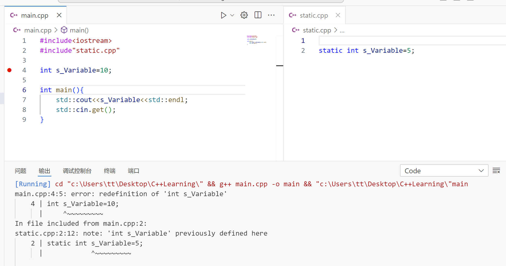
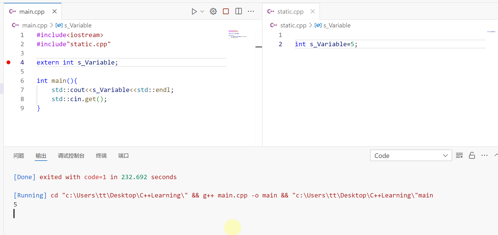
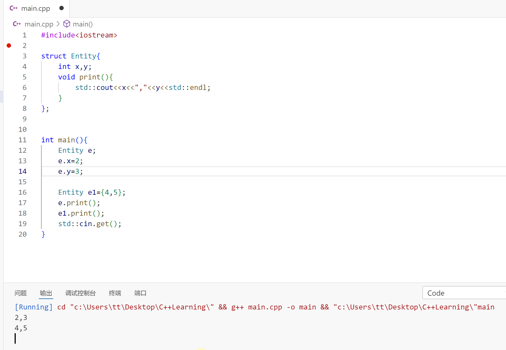
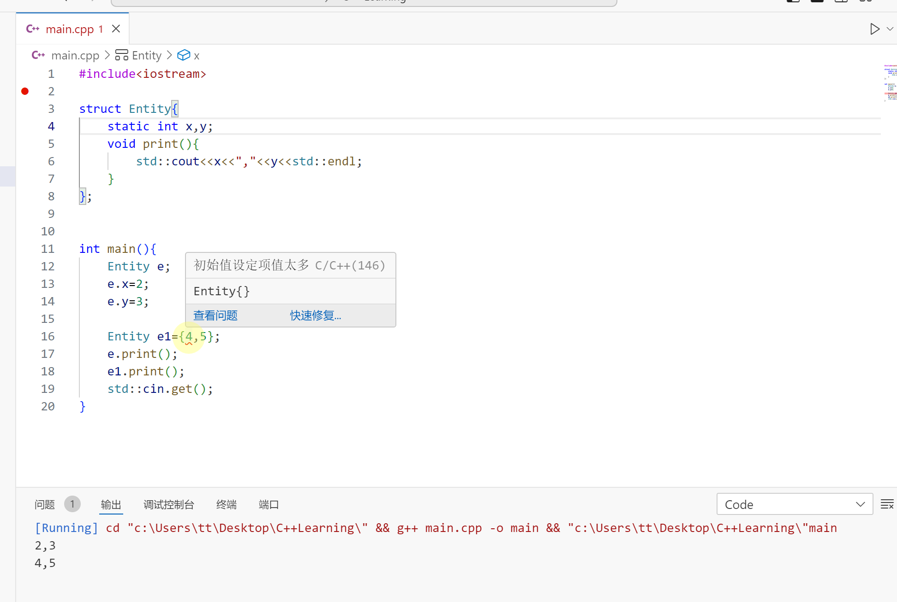
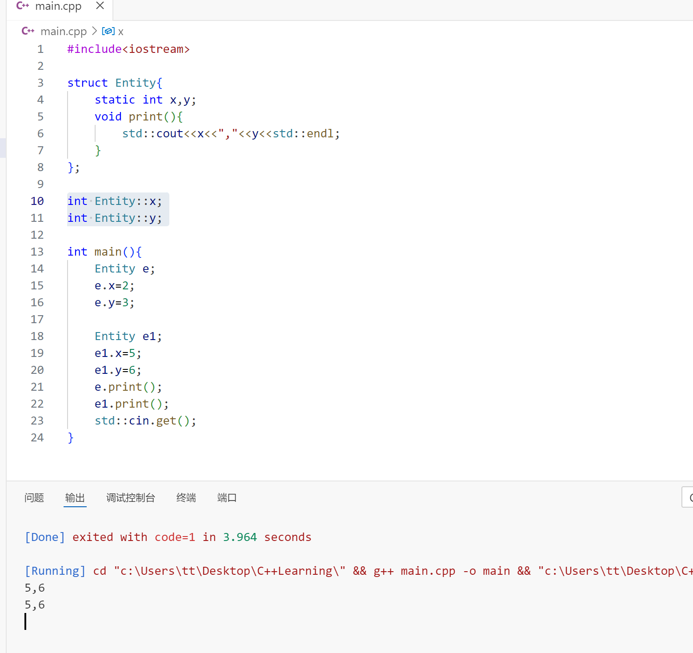
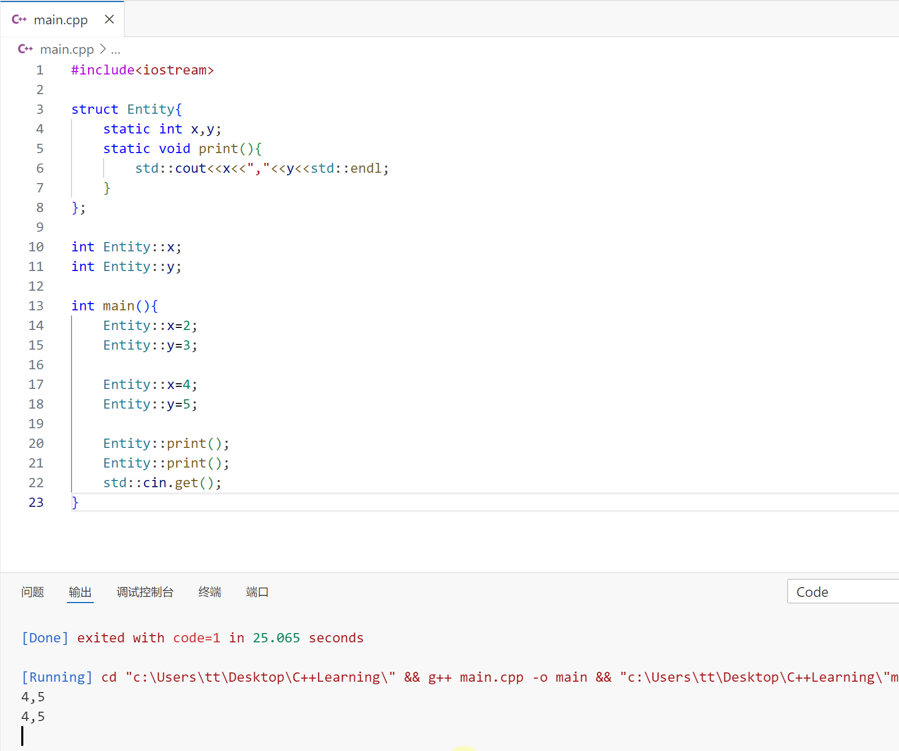
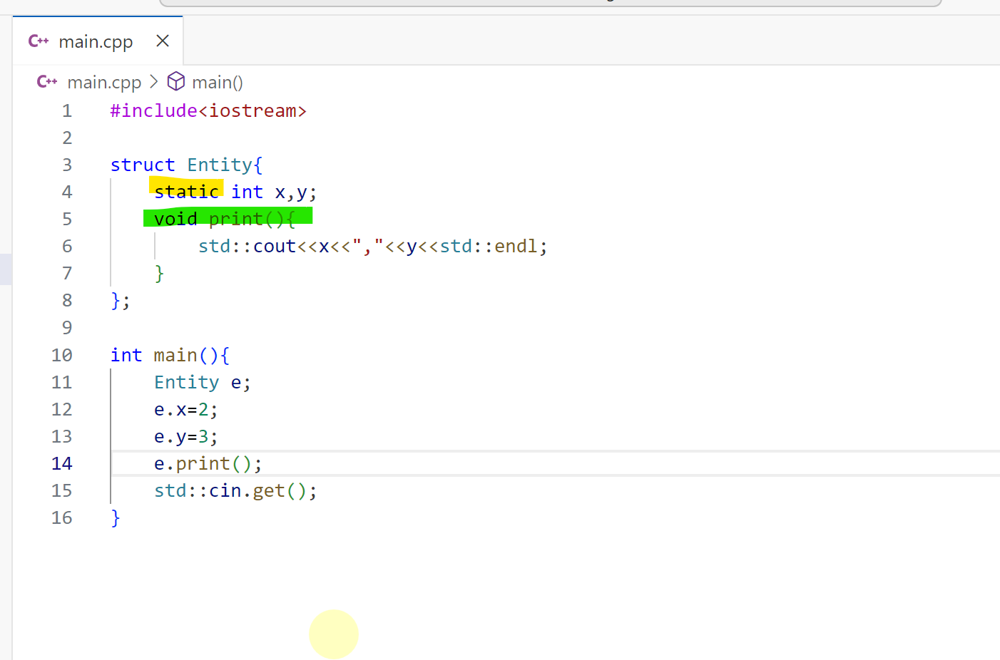
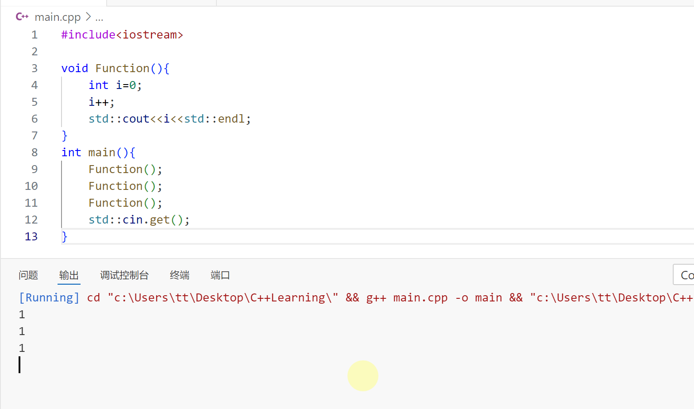
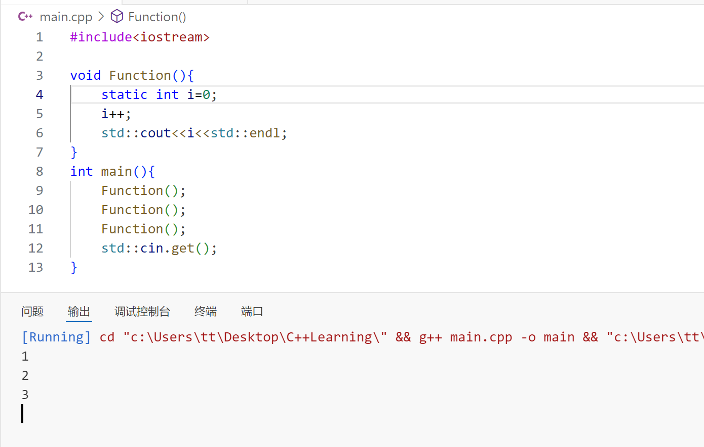
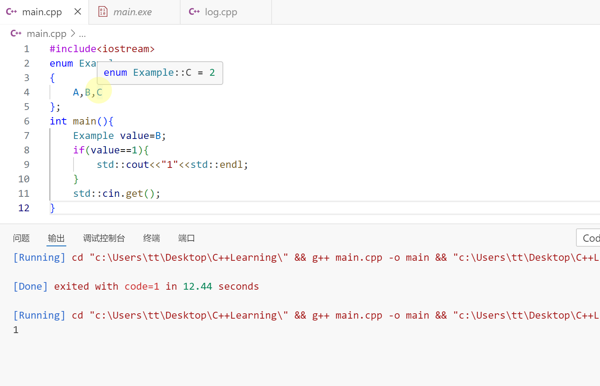

# 安排

​	

- [ ] C++学习 24/94

  ---

  

👇【21】C++中的静态

$$
\begin{cases}
类外面的static：意味着声明的static符号链接只在内部，只对定义它的翻译单元可见\\
\\
类或结构体内部的静态变量(static):该变量实际上将与类的所有实例共享内存，\\
该静态变量在所有实例中，静态变量只有一个实例
\end{cases}
$$

---

- 类和结构体外部的静态

  

  修改方法：

  去掉**main.cpp**中的赋值，将其标记为**extern**。这意味着它会在外部翻译单元中寻找**s_Variable**变量。这被称为**external linking**。
  

> [!TIP]
>
> 最好将函数和变量标记为静态的，除非真的需要它们跨翻译单元链接。

---

👇【22】C++中类和结构体中的静态

静态在一个类中意味着特定的东西，如果把它和变量一起用，意味着在类的所有实例中，这个变量只有一个实例，即如果某个实例改变了这个静态变量，它会在所有实例中反映这个变化，这是因为这里只有一个变量，尽管已经创建了一大堆的类的实例。正因如此，通过类实例来引用静态变量是没有意义的。

如果让变量变成静态的，就会报错👇

因为x,y不再是类成员，对代码进行一些修改

可见打印了两次5，6。这是因为修改后的代码让这两个变量在Entity类的所有实例中只有一个实例。即两个实例指向的是相同的内存，即两个不同的实例他们的x,y指向同一个地方。

用纯静态的方法也能得到同样的结果。

> [!NOTE]
>
> 静态方法不能访问非静态变量。
>
> 结构体中的**x,y**是静态变量，而**void**为非静态方法，非静态方法不能访问静态变量。

---

👇【23】C++中的局部静态变量

---

👇【24】C++中的枚举

下面是一个枚举的例子

枚举实际上也是给某个变量赋值，目的是简化代码，在枚举中，第一个变量默认为0,后面的递增，但是也可以修改，修改后只会影响此变量和后面的变量的值，依旧递增。

---

