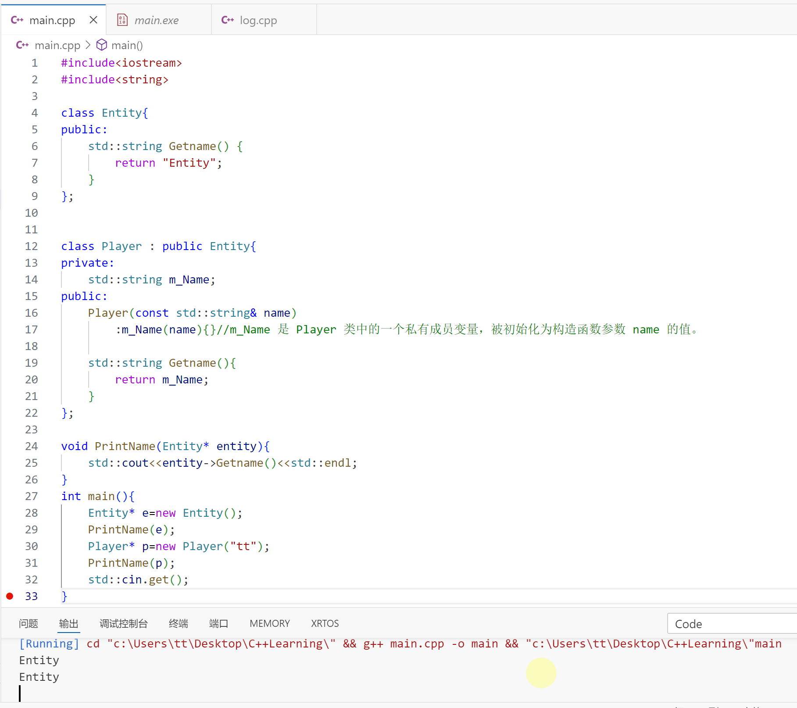
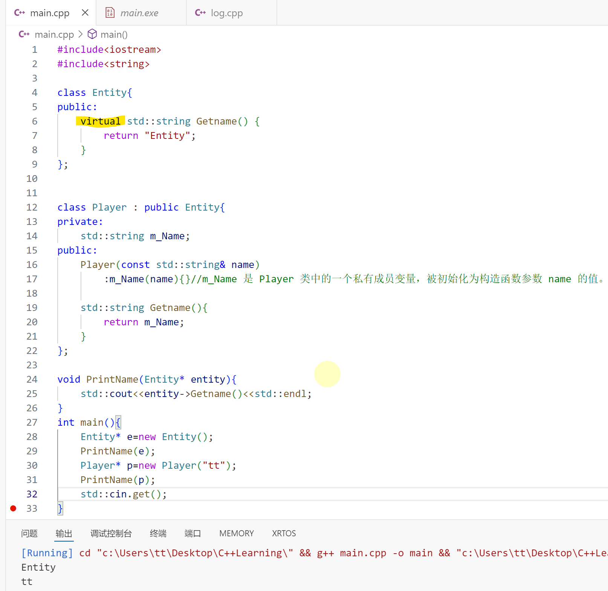

# 安排

- [ ] C++学习 28/94

- [ ] vscode字体备份：Consolas, 'Courier New', monospace

  ---

  👇【28】C++虚函数

  假设我们有两个类，A和B，B是A派生出来的，也就是B是A的子类，如果我们在A类中创建一个方法，标记为**virtual**，我们可以选择在B类中重写那个方法，让它做其他的事情。

  



但是，我们在编写了一段打印函数**void PrintName()**之后，却打印了两次“Entity”。原因是对于PrintName()函数，他的参数是**Entity**，这意味着当我们调用GetName函数时，如果是在**Entity**里面，那么它会从Entity类中找这个叫做**GetName**的函数，然而我们希望C++能够意识到，我们这里传里的Entity实际上是**Player**，所以请调用下面的GetName函数，这就是虚函数出现的地方。

虚函数引入了一种Dynamic Dispatch（动态联编）的东西，通过虚函数表（v表），这样可以在它运行时，将其映射到正确的覆写（override）函数。



仅在黄色标记处加入了**“virtual”**就达到了想要的效果。

> [!IMPORTANT]
>
> 我们只需在把基类的成员函数设为virtual，其派生类的相应的函数也会自动变为虚函数。

#### 附代码：

```C++
#include<iostream>
#include<string>

class Entity{
public:
    virtual std::string Getname() {
        return "Entity";
    }
};


class Player : public Entity{
private:
    std::string m_Name;
public:
    Player(const std::string& name)
        :m_Name(name){}//m_Name 是 Player 类中的一个私有成员变量，被初始化为构造函数参数 name 的值。

    std::string Getname(){
        return m_Name;
    }
};

void PrintName(Entity* entity){
    std::cout<<entity->Getname()<<std::endl;
}
int main(){
    Entity* e=new Entity();
    PrintName(e);
    Player* p=new Player("tt");
    PrintName(p);
    std::cin.get();
}
```

---

👇【29】C++纯虚函数