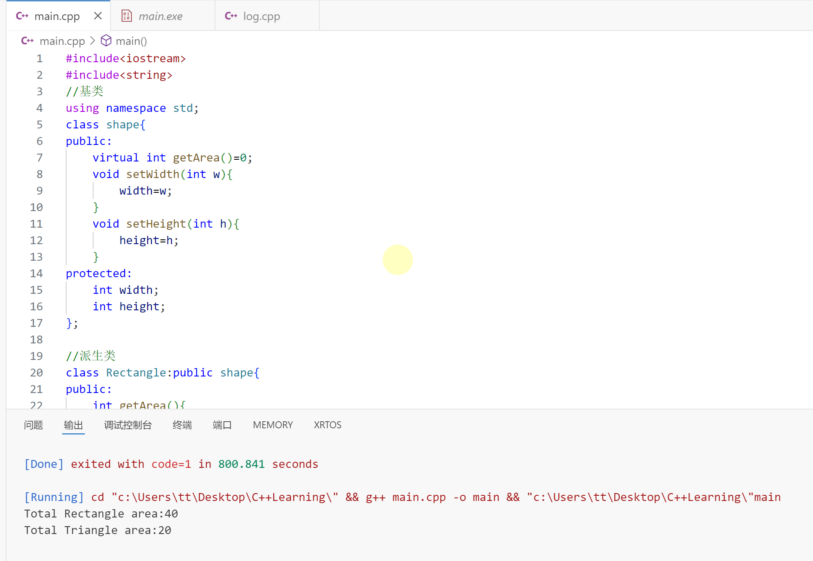

# 安排

- [ ] C++学习

  ---

  👇【29】C++纯虚函数

纯虚函数允许我们在基类中定义一个没有实现的函数，然后强制子类去实现该函数。

纯虚函数必须被实现，才能创建这个类的实例

设计**抽象类**（通常称为 ABC）的目的，是为了给其他类提供一个可以继承的适当的基类。抽象类不能被用于实例化对象，它只能作为**接口**使用。如果试图实例化一个抽象类的对象，会导致编译错误。

因此，如果一个 ABC 的子类需要被实例化，则必须实现每个纯虚函数，这也意味着 C++ 支持使用 ABC 声明接口。如果没有在派生类中重写纯虚函数，就尝试实例化该类的对象，会导致编译错误。

可用于实例化对象的类被称为**具体类**。

请看下面的实例，基类 Shape 提供了一个接口 **getArea()**，在两个派生类 Rectangle 和 Triangle 中分别实现了 **getArea()**：

```C++
#include<iostream>
#include<string>
//基类
using namespace std;
class shape{
public:
    virtual int getArea()=0;
    void setWidth(int w){
        width=w;
    }
    void setHeight(int h){
        height=h;
    }
protected:
    int width;
    int height;
};

//派生类
class Rectangle:public shape{
public:
    int getArea(){
        return(width*height);
    }
};
class Triangle:public shape{
public:
    int getArea(){
        return (width*height/2);
    }
};
int main(){
    Rectangle Rect;
    Triangle Tri;
    Rect.setWidth(5);
    Rect.setHeight(8);
    std::cout<<"Total Rectangle area:"<<Rect.getArea()<<std::endl;
    Tri.setWidth(5);
    Tri.setHeight(8);
    std::cout<<"Total Triangle area:"<<Tri.getArea()<<std::endl;
    std::cin.get();
}
```



输出结果如上图所示

---

👇【30】C++可见性

**privita , public , protect**

**public**:谁都可以访问

**privite**:只有友元和所在类内部可以访问

**protect**：只有所在类内部、友元、子类可以访问 

---

👇【31】C++数组

一个例子：

```C++
#include<iostream>
#include<string>
class Entity{
public:
    int* example=new int[5];
    Entity(){
        for(int i=0;i<=4;i++){
            example[i]=i;
        }
    }
};
int main(){
    Entity e;
    std::cout<<*(e.example+3)<<std::endl;
    std::cin.get();
}
```

其中涉及到了**堆**和**栈**的内容，上述中**new in**是堆的方法，这部分后续再整理。