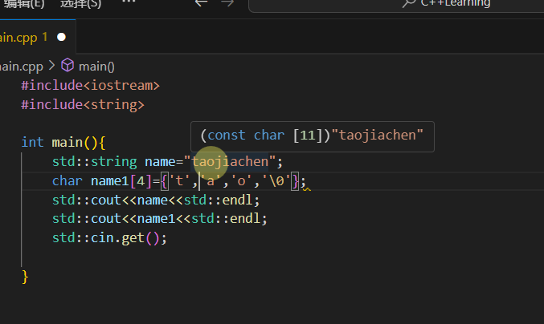

# 安排

- [ ] C++学习 33/94

  ---

  👇【32】C++字符串

   如果将来不会修改字符串，可以再定义时加上 **const**.

  

  > [!IMPORTANT]
  >
  > 如果是用第二种方式，即使用数组来存储字符串，记得在末尾加上'0'，或者直接加上 0（这表示为 0 的 ascii 值）。

  在头文件中添加 **include <string>** 之后，可以使用 **std:: srting** 来代替 const char *，* 这是因为 string 有一个构造函数，它接受 char * 或者 const char* 参数，从下面这个也可以看出。

> [!IMPORTANT]
>
> - char
>   - `char` 是 C 和 C++ 中的基本数据类型，用于存储单个字符。它在内存中占用 1 个字节（在大多数常见的系统中）。例如，`char ch = 'a';` 定义了一个名为 `ch` 的变量，它存储了字符 `'a'`。这个字符在内存中有对应的 ASCII 码值（在 ASCII 编码中，`'a'` 对应的十进制值是 97），变量 `ch` 实际上存储的就是这个整数值 97。
> - char *：
>   - `char*` 是一个指针类型，它指向一个 `char` 类型的字符或者一个以 `'\0'` 结尾的字符序列（也就是字符串）。例如，`char* str = "hello";`，这里 `str` 是一个指针，它指向存储字符串 `"hello"` 的内存区域的首地址。这个字符串在内存中是连续存储的，包括字符 `'h'`、`'e'`、`'l'`、`'l'`、`'o'` 和 `'\0'`（`'\0'` 用于标记字符串的结束）。

  如果想要把两个字符串合并到一起，不能用以下的做法：

原因是双引号里面的东西是 const char 数组，并不是真正的字符串，不能把这两个指针相加，不能将两个数组相加。如果想要这样做，一个很简单的方法是把它分开成多行，然后 name+= "jia"。

name 是一个字符串，把它加到一个字符串上，+= 这个操作符在 string 类被重载了，所以可以这样写。

或者还有一种方法就是：

这相当于新建了一个字符串，附加这个字符数组给它。

如果想找到字符串中的文本，可以用 name.find("想找的文本")，这会返回文本在字符串中开始的位置，比方说我想在拼成的字符串中找到 "oj"，我定义了一个布尔类型的变量 contains 用于存放是否能找到（是/否 = 1/0），std::string:: npos 表示一个无效的位置，意思就是判断“oj”存在的位置是否不是一个无效的位置，即是否存在 "oj"：

如果想在主函数外部定义一个用于答应 name 的函数时可以写成这样：

注意在定义时用 **&** 即引用字符串。

---

👇【33】C++字符字面量

---

