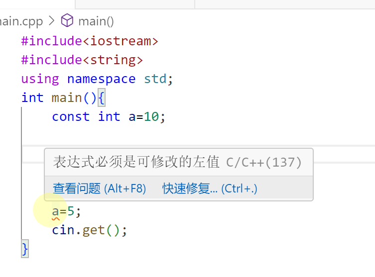
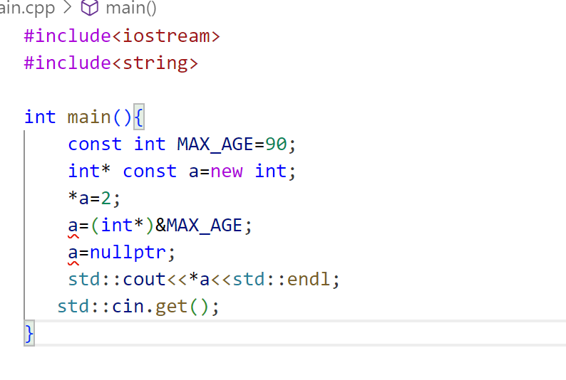
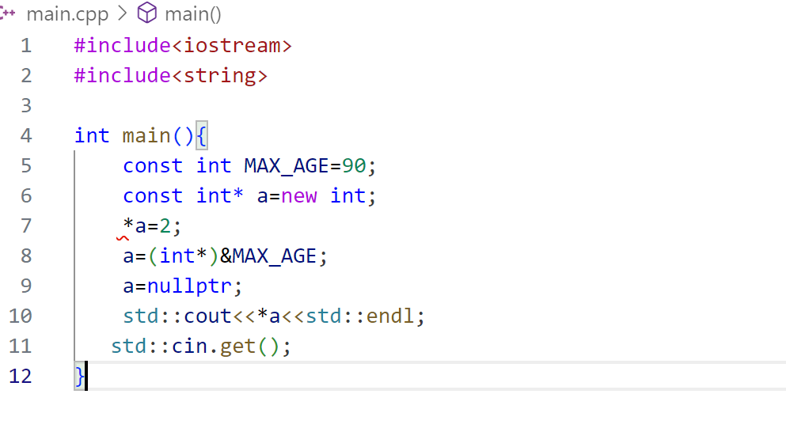
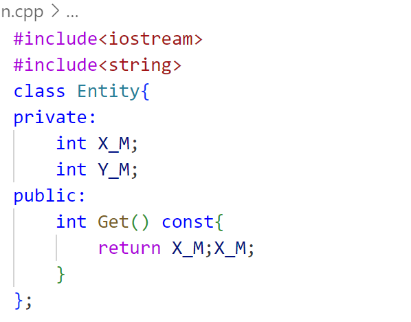
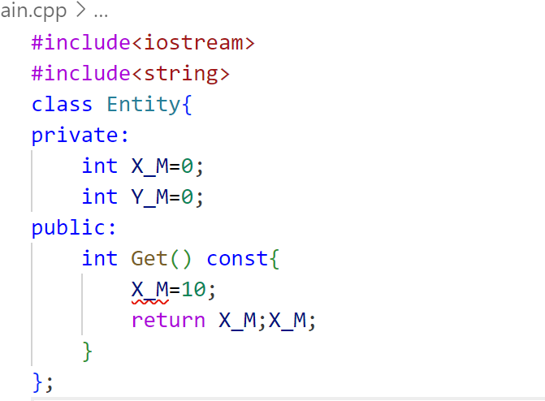
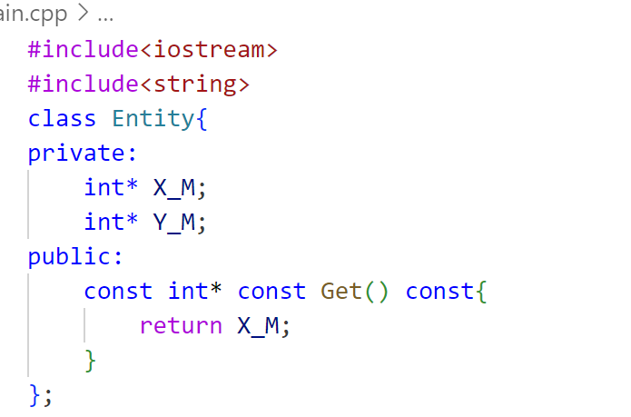

# 安排

- [ ] C++学习  34/94

  ---

  👇【34】C++中的 const
  
  const 用于 **承诺** 某些东西不会改变（但也不是一定不能改变的）。
  
  举个例子：
  
  

const 从语法上已经指定了 a 是一个常数，不打算修改它。并且通常在程序中它也是一个不需要修改的变量，比如说边界值，或者最大值之类的东西。

另外有两种情况：

1.

```C++
#include<iostream>
#include<string>

int main(){
    const int MAX_AGE=90;
    int* const a=new int;
    *a=2;
    a=(int*)&MAX_AGE;
    a=nullptr;
    std::cout<<*a<<std::endl;
   std::cin.get();
}
```

结果：



即可以改变指针指向的地址的内容，但不能改变指针指向。

2.

```C++
#include<iostream>
#include<string>

int main(){
    const int MAX_AGE=90;
    const int* a=new int;
    *a=2;
    a=(int*)&MAX_AGE;
    a=nullptr;
    std::cout<<*a<<std::endl;
   std::cin.get();
}
```

结果：


即可以改变指针指向，但是不能改变内容。

const 的第三种用法：在类中的方法名后加 const：表示这个方法不会对类做实际的修改，即只读取数据而不修改数据



如果尝试修改数据呢？比如说尝试把 X_M 的值做修改：报错噢~因为已经承诺这个方法并不改变实际的类。


下面这段方法中写了三个 const：


这意味着返回了一个不能修改的指针；指针的内容也不能修改；而且这个方法也承诺不修改实际的 Entity 类。

**mutable** 允许函数是常量方法，但可以修改变量。

