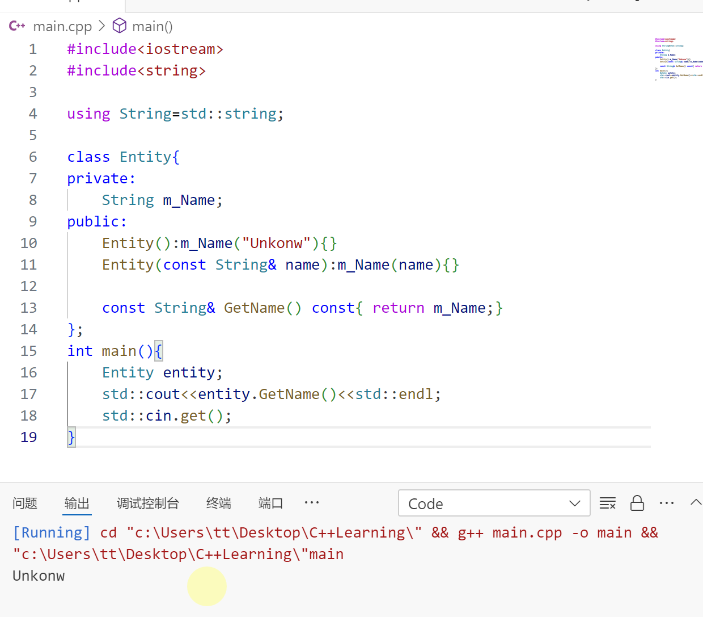
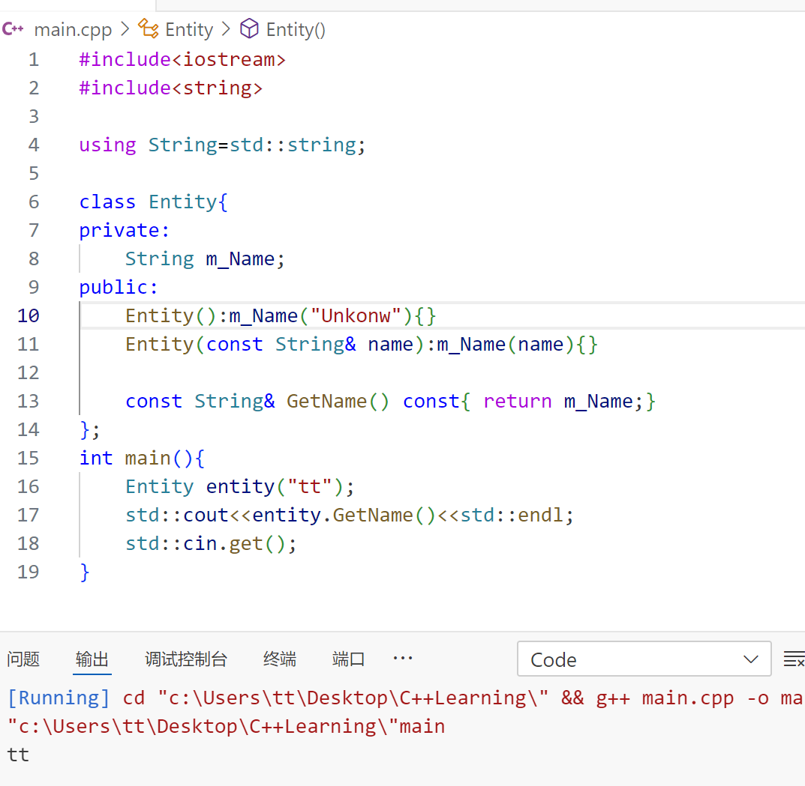
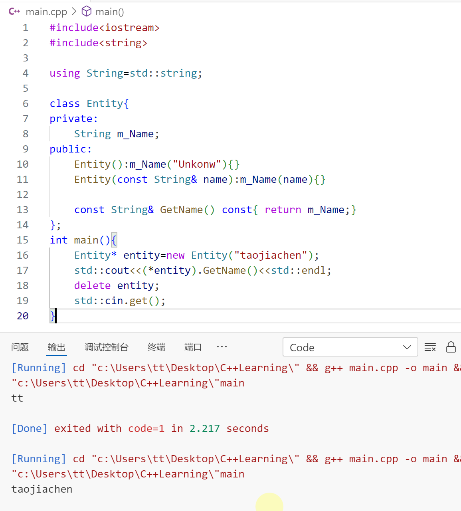
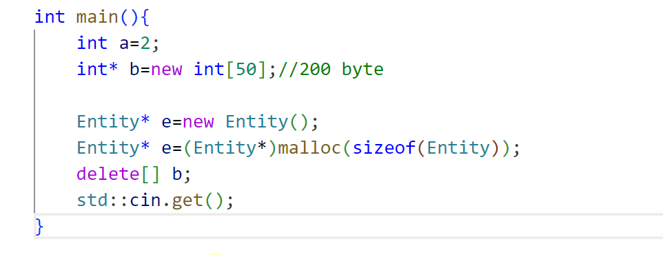

# 安排

- [ ] C++学习 39/94
- [ ] [obgnail/typora_plugin: Typora plugin. Feature enhancement tool | Typora 插件，功能增强工具](https://github.com/obgnail/typora_plugin?tab=readme-ov-file) 一个好用的 Typora 插件

---

👇【38】创建并初始化 C++对象

- 栈对象有一个自动的生存期，他们的生存期实际上由它声明的地方作用域决定，只要变量超出作用域，也就是说内存被释放了，因为当作用域结束的时候，栈会弹出，作用域里面的东西即栈上的任何东西会被释放。

- 在堆中分配一个对象，它会一直待在那里，直到做出决定我不需要它了，我想释放这个对象，你想怎么处置那段内存都行。

下面会分别介绍这两种创建对象的方法的代码是什么样子的。

 1.栈

一切都很好。但某些情况下不能这么做。如果我们想让某个东西在作用域之外依然存在，就不能分配到栈上，不得不求助于堆分配。 

2.堆

如果想把上述代码转化为堆分配，首先要做的就是改变类型，类型不再是 Entity 而是 Entity*，然后通过 new 关键字，这里最大的区别不是那个类型变成了指针，而是 new 关键字。 

堆的计算比栈慢，而且如果使用了 new 关键字即在堆上创建对象，在后面要使用 delete 关键字来释放内存，即堆需要手动释放内存。

这是我们创造对象的两种方法，如何选择呢？如果对象太大，或者要显式地控制对象的生存期，那就用堆上创建，如果不需要上述这两点的话，那就在栈上分配吧。而在堆上分配，需要手动 delete，这可能会导致内存泄漏--如果忘记调用 delete。

---

👇【39】C++ new 关键字

空闲列表--维护那些有空闲字节的地址

new 关键字不仅分配内存，它还会调用构造函数。调用 new，会调用隐藏在里面的 malloc 函数，它代表内存分配。传入一个 `size` 也就是我们要多少字节，然后返回一个 void 指针，这就是它的作用。

即第一行代码相当于写了 `malloc(sizeof(Entity))` 然后将其转换为 `Entity*` 类型。两行代码的区别是，上一行代码调用了 `Entity()` 函数，而下面一段代码仅仅是分配内存，然后给我们一个指向那个那个内存的指针，没有调用构造函数。

不要忘了 `delete e`，这点很重要，如果我们没有释放内存，它就不会被放回空闲列表，所以就不能再被 `new` 调用后再分配，直到我们调用 `delete`。

如果用 new [] 来分配数组，就像这里的 b 一样，那么要用 `delete[]`

