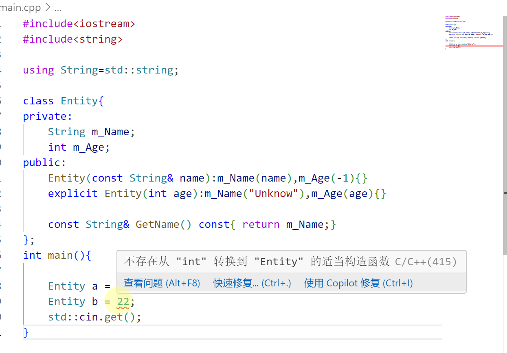
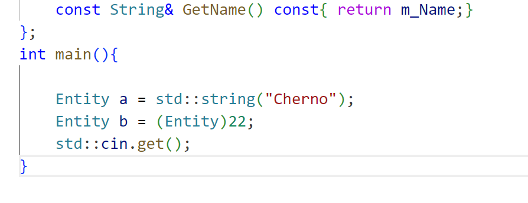

# 安排

- [ ] C++学习 33/94

---

👇【40】C++ 隐式转换与explicit关键字

如果我们开始有一个数据类型，然后有另一个类型，在两者之间C++允许隐式进行转换，而不需要用cast做强制转换。 

隐式转换了一个例子：

```C++
#include<iostream>
#include<string>

using String=std::string;

class Entity{
private:
    String m_Name;
    int m_Age;
public:
    Entity(const String& name):m_Name(name),m_Age(-1){}
    Entity(int age):m_Name("Unknow"),m_Age(age){}

    const String& GetName() const{ return m_Name;}
};
int main(){

    Entity a = std::string("Cherno");
    Entity b = 22;
    std::cin.get();
}   
```



但是如果像上面一样在一个构造函数前加入关键字`explicit`的话，会报错，解决办法是，将其显式地转换为一个`Entity`



`explicit`关键字的作用：它显式地调用构造函数，而不是每次调用构造函数时，C++编译器默认地进行隐式转换，将`int`转换为`entity`，它可以防止做意外转换，导致性能问题或Bug。

---

👇【41】C++ 运算符及重载

**运算符**：运算符是我们使用的一种符号，通常代替一个函数来执行一些事情，除了算术运算符以外，还有其他运算符，包括`dereference(逆向引用)运算符,箭头运算符`

**重载**:给运算符重载赋予新的含义，或者添加参数，或者创建，允许在程序中定义或更改运算符的行为。

```C++
#include<iostream>
#include<string>

struct Vector2{
    float x,y;

    Vector2(float x, float y)
        : x(x), y(y) {}
    
    Vector2 Add(const Vector2& other) const{
        return Vector2(x + other.x, y + other.y);
    }
    Vector2 operator+(const Vector2& other) const{
        return Add(other);
    }
    Vector2 Multiply(const Vector2& other) const{
        return Vector2(x * other.x, y * other.y);
    }
    Vector2 operator*(const Vector2& other) const{
        return Multiply(other);
    }
    bool operator==(const Vector2& other) const{
        return x == other.x && y == other.y;
    }
    bool operator!=(const Vector2& other) const{
        return !(*this == other);
    }
};
std::ostream& operator<<(std::ostream& stream, const Vector2& other){
    stream << other.x << ", " << other.y;
    return stream;
}
int main(){
    Vector2 position(4.0f, 4.0f);
    Vector2 speed(0.5f, 1.5f);
    Vector2 powerup(1.1f, 1.1f);
    Vector2 result1 = position.Add(speed.Multiply(powerup)) ;
    Vector2 result2 = position + speed * powerup;
    if(result1 == result2){
        std::cout << "Both results are equal" << std::endl;
    }
    
    std::cout << result1 << std::endl;
}
```


---

👇【42】C++ this关键字

 在C++里面，每一个对象都能通过this指针来访问自己的地址。

当成员函数中某个变量与成员变量名字相同，则使用this关键字来表示成员变量。

 或者，需要返回类变量或者结构体变量的时候，使用this关键字。

```C++
#include<iostream>
#include<string>

class Entity{
public:
    int x,y;
    Entity(int x, int y){
        this->x = x;
        this->y = y;
    }

    int GetX() const{
        return x;
    }
};

int main(){
    Entity e(10,5);
    std::cout << e.GetX() << std::endl;
    std::cin.get();
}

```

---

​	