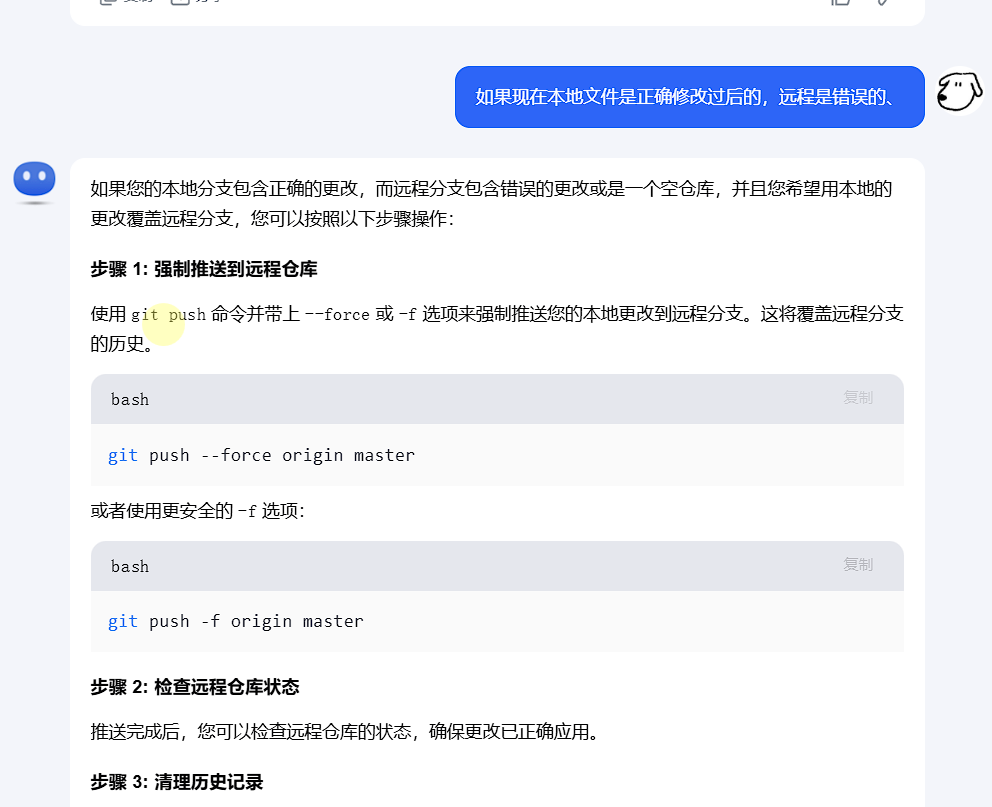

# Typora+Github

[blog.csdn.net/weixin_44924882/article/details/108936635?ops_request_misc=%257B%2522request%255Fid%2522%253A%2522164bf81beb592d1e413ed0a10e280641%2522%252C%2522scm%2522%253A%252220140713.130102334.pc%255Fall.%2522%257D&request_id=164bf81beb592d1e413ed0a10e280641&biz_id=0&utm_medium=distribute.pc_search_result.none-task-blog-2~all~first_rank_ecpm_v1~rank_v31_ecpm-2-108936635-null-null.142^v100^pc_search_result_base7&utm_term=Typora%2Bgithub代替云笔记（git上传文件至github）&spm=1018.2226.3001.4187](https://blog.csdn.net/weixin_44924882/article/details/108936635?ops_request_misc=%7B%22request%5Fid%22%3A%22164bf81beb592d1e413ed0a10e280641%22%2C%22scm%22%3A%2220140713.130102334.pc%5Fall.%22%7D&request_id=164bf81beb592d1e413ed0a10e280641&biz_id=0&utm_medium=distribute.pc_search_result.none-task-blog-2~all~first_rank_ecpm_v1~rank_v31_ecpm-2-108936635-null-null.142^v100^pc_search_result_base7&utm_term=Typora%2Bgithub代替云笔记（git上传文件至github）&spm=1018.2226.3001.4187)

